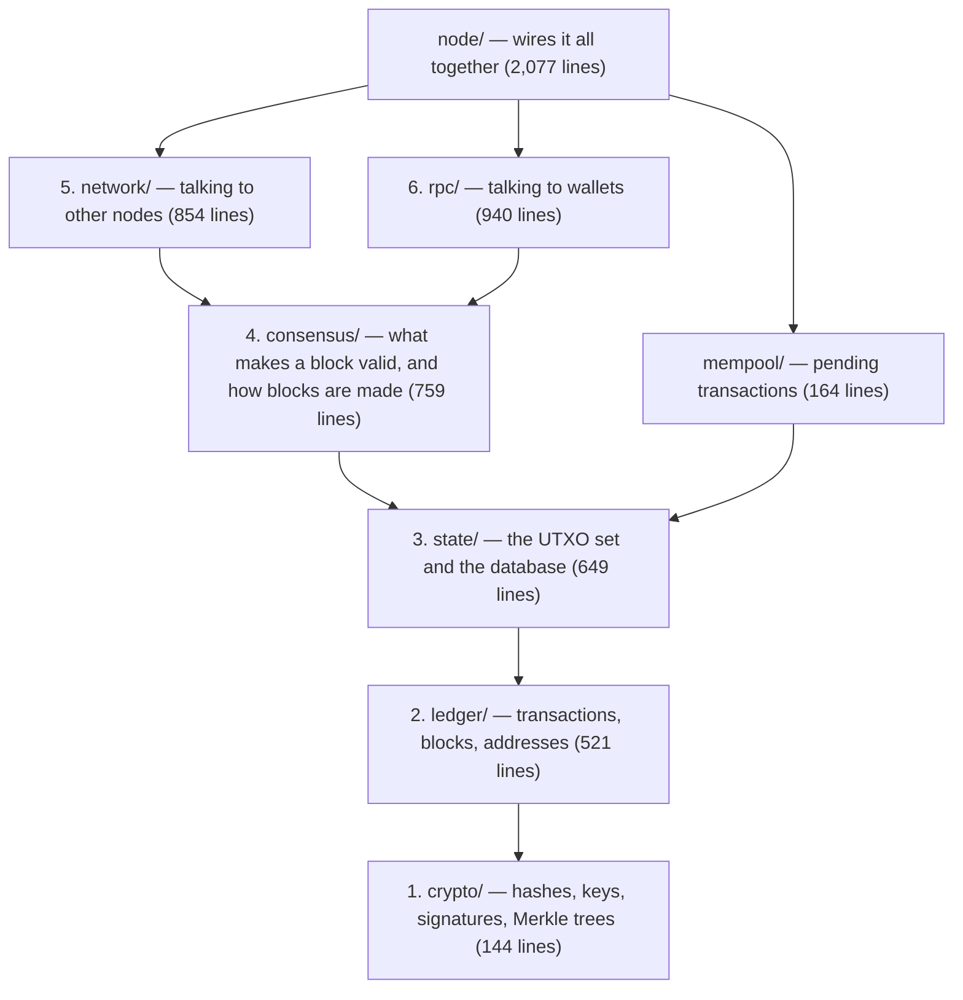

# Read the whole chain in an afternoon

A guided walk through PlainChain, module by module, in the order the
system is built. Each stop says what the module does, which file to open,
what to look for, one test to run that proves a rule, and one exercise to
try. Budget: about four hours if you read carefully, less if you skim and
run the tests.

You need Node.js 20+ and the repository:

```bash
git clone https://github.com/behrouzbk/plainchain.git && cd plainchain && npm ci
npm test        # 619 tests, ~3 minutes: everything you are about to read is checked here
```

Run a single test file with `npx vitest run tests/<module>/<file>.test.ts`,
and a single test with `-t "part of its title"`.

## The shape of the thing

A blockchain node is six ideas stacked on each other. PlainChain keeps
them in six directories, and each depends only on the ones below it:



The rule is stated in `CONTRIBUTING.md` and shows in the imports: `crypto/`
imports nothing from the project, `ledger/` imports only `crypto/`, and so
on. Read in that order and nothing will refer to something you have not
seen yet.

Two things to keep in mind throughout:

- **Money is `bigint`.** Every amount is an integer of base units. There is
  no floating point anywhere near a balance.
- **Determinism first.** Two nodes given the same blocks must end with
  byte-identical state, so everything that gets hashed is serialized with a
  fixed field order. Whenever you see a `join("|")`, that is a canonical
  serialization.

## 1. Crypto — 20 minutes

**What it does.** Four primitives, all from Node's built-in `crypto`
module. There is no cryptography library in the dependency tree; if you
can read these files you have seen every primitive the chain uses.

**Open** `src/crypto/hash.ts` (SHA-256, 9 lines), `src/crypto/keypair.ts`
(Ed25519 key pairs, exported as hex DER), `src/crypto/signature.ts`
(sign and verify), `src/crypto/merkle.ts`.

**Look for.** In `merkle.ts`, `merkleRoot` folds a list of transaction ids
into one hash; an odd last element is paired with itself. `merkleProof`
and `verifyMerkleProof` are what lets a wallet prove a transaction is in a
block without downloading the block — you will meet them again in module
6 and in the light client.

**Run.** `npx vitest run tests/crypto/merkle.test.ts` — including
"rejects a proof for a different leaf, a tampered sibling, or a flipped
position".

**Exercise.** Write a test that builds a Merkle proof for a leaf, changes
one sibling hash, and asserts `verifyMerkleProof` returns false. Then
explain in a comment why a proof needs the *position* (left or right) of
each sibling, not just its hash.

## 2. Ledger — 40 minutes

**What it does.** Defines what a transaction and a block *are*, how they
are hashed, and the rules that hold with no other context (a transaction
can be checked here before anyone looks at the chain).

**Open** `src/ledger/types.ts` first (47 lines — the whole data model:
`TxInput`, `TxOutput`, `Transaction`, `BlockHeader`, `Block`). Then
`src/ledger/transaction.ts`, `src/ledger/block.ts`, `src/ledger/address.ts`.

**Look for.**

- `getSigningPayload` in `transaction.ts`: what an input's signature is
  *over*. It deliberately leaves out every input's own signature and public
  key, so all inputs sign the same message and attaching a signature never
  changes what was signed. `computeTransactionId` hashes the full body
  including signatures, so an id is only final once every input is signed.
- `computeBlockHash` in `block.ts`: seven header fields joined with `|`.
  Change any one — the timestamp, the nonce, the Merkle root — and the hash
  changes; that is the whole basis of proof of work and of chain linkage
  (`previousHash`). Note the optional `signer` and `signature` fields at the
  end, used only by proof of authority (module 4).
- `deriveAddress`: an address is just `sha256(publicKey)`. The `l1…`
  checksummed form in `address.ts` exists only for humans; consensus never
  sees it.
- `validateTransactionStructure`: the context-free rules — id matches
  content, at least one output, every amount positive, fee non-negative, no
  outpoint used twice. These live here rather than in the mempool because
  blocks from peers never pass through the mempool.

**Run.** `npx vitest run tests/ledger/transaction.test.ts` and
`tests/ledger/block.test.ts`. Find the test that shows a transaction id
"changes when an output amount changes".

**Exercise.** Add a new context-free rule: a transaction may have at most
16 outputs. Write the failing test first (`tests/ledger/transaction.test.ts`),
then add the check to `validateTransactionStructure`. Run the whole suite:
which other tests notice, and why?

## 3. State — 40 minutes

**What it does.** The UTXO set: every unspent output, keyed by
`txId:outputIndex`, stored in LevelDB. Applying a transaction consumes its
inputs and creates its outputs; this is the only place balances exist.

**Open** `src/state/utxoSet.ts` (the heart of this module), then
`src/state/db.ts` (the one place LevelDB is opened, with a named sublevel
per kind of data) and `src/state/chainState.ts` (blocks, headers, the tip,
undo records, indexes).

**Look for.**

- `validateTransaction` in `utxoSet.ts`, around line 162: the stateful
  rules, in order. Every input must reference an existing unspent output; a
  coinbase output cannot be spent until it is `coinbaseMaturity` blocks
  deep; the input's public key must hash to the output's address (you own
  it); the signature must verify over the signing payload; and inputs must
  cover outputs plus fee. This function is why nobody can spend coins they
  do not have.
- `applyTransaction` returns a `TxUndo` and `undoTransaction` reverses it.
  Undo records are what make reorganisations cheap (module 4): to abandon a
  block, replay its undo records backwards.
- `beginStaging` / `takeStagedOps` / `discardStaging`: writes are staged in
  memory and committed as one LevelDB batch. A crash in the middle of
  adopting a block leaves the old state intact, never a half-applied one.

**Run.** `npx vitest run tests/state/utxoSet.test.ts` — "rejects a
double-spend of an already-spent output", "rejects a spend signed by a key
that does not own the referenced output", "rejects a spend whose signature
does not verify (tampered outputs)".

**Exercise.** Write a test that applies a transaction, undoes it, and
asserts the UTXO set is byte-identical to before (hint: list every entry
before and after). Then break `undoTransaction` on purpose — skip restoring
one spent input — and watch which test catches it.

## 4. Consensus and the mempool — 60 minutes

**What it does.** Decides which blocks are valid, which chain wins when
two compete, and how a node produces a block of its own. This is where the
money rules live.

**Open** `src/consensus/blockValidator.ts` first. `validateHeader` is the
header-only rules (hash matches, target as the retarget rule dictates,
the seal, linkage to the parent, timestamp bounds, checkpoint). `validateBlock`
adds the body rules: exactly one coinbase at index 0, size limits, Merkle
root matches, no duplicate transactions, no outpoint spent twice within
the block, and **coinbase ≤ reward + fees** — the line that stops inflation.

Then `src/consensus/engine.ts`: the one place proof of work and proof of
authority differ. `PowEngine.verifySeal` checks the hash is below the
target; `PoaEngine.verifySeal` checks the signer is an authority, the
signature verifies over the seal hash, and the signer has not signed too
recently. Everything else in consensus is shared.

Then `src/consensus/difficulty.ts` (`nextTarget`: how the target moves
every `difficultyRetargetInterval` blocks, shared with the light client so
the two can never disagree), `src/consensus/forkChoice.ts` (18 lines:
heavier chain wins, strictly), `src/consensus/monetary.ts` (`blockRewardAt`,
the halving schedule, and `rulesHash` — a fingerprint of every rule that
nodes compare when they meet, so nodes on different rules refuse each
other instead of forking silently).

Finally `src/mempool/mempool.ts`: pending transactions ordered by fee,
with replace-by-fee — a conflicting transaction is admitted only if it
pays more than everything it replaces plus the minimum fee.

**Run.** `npx vitest run tests/consensus/blockValidator.test.ts` —
"rejects a block with more than one coinbase (inflation)", "rejects a
coinbase that claims more than reward + fees", "rejects a block whose
hash does not meet its own target". And `tests/consensus/engine.test.ts`
— "attack: one authority cannot monopolize the chain".

**Exercise.** Change `isBetterChain` in `forkChoice.ts` from "strictly
more work" to "at least as much work". Run `tests/node/node.test.ts`: the
reorg tests fail. Read the failure and write one sentence on why a tie
must *not* cause a switch (think about two nodes that each mined a block
at the same height).

## 5. Network — 50 minutes

**What it does.** Nodes gossip blocks and transactions over WebSockets,
sync headers first, find peers, and score misbehaviour. Everything that
arrives from a peer is untrusted.

**Open** `src/network/protocol.ts` (the nine message types and
`decodeMessage`), `src/network/wireShapes.ts` (every payload type-checked
field by field before a handler sees it — a block's claimed hash is
recomputed, never believed), `src/network/p2pServer.ts` (connections,
handshake, limits), `src/network/reputation.ts` (penalties and bans),
`src/network/addressBook.ts` (peers remembered across restarts).

**Look for.** In `p2pServer.ts`, the handshake carries `networkId`,
`genesisHash` and `rulesHash`; a peer that disagrees on any of them is
dropped before a single block is exchanged. Then find where a message
sent *before* the handshake is refused. In the node (`src/node/node.ts`,
`handleHeaders` around line 1383), headers are validated and their
cumulative work tracked *before* any block body is downloaded — a peer
claiming a heavier chain has to prove it header by header first.

**Run.** `npx vitest run tests/network/protocol.test.ts` — "a block
whose claimed hash is not the hash of its header is refused", and
`tests/network/p2pServer.test.ts` — "rejects a peer on a different network".
Then the big one: `npx vitest run tests/node/node.test.ts -t "adversarial"`,
where a raw protocol "injector" sends a real node inflated coinbases,
forged blocks and garbage, and the node bans it every time.

**Exercise.** Using the injector in `tests/node/node.test.ts` (see
`makeInjector`), write an attack test of your own: send a block whose
`previousHash` points at a block that does not exist. What does the node
do with it, and why is that the right behaviour? (Look for "orphan" in
`node.ts`.)

## 6. RPC and the wallet — 40 minutes

**What it does.** JSON-RPC 2.0 over HTTP(S) is how a wallet talks to a
node: get the tip, list unspent outputs, submit a signed transaction, ask
for a Merkle proof. The wallet is a separate program that trusts the node
for nothing it can verify itself.

**Open** `src/rpc/jsonRpc.ts` (the method table: each entry names its
parameters, whether it needs the bearer token, and its handler), then
`src/wallet/txBuilder.ts` (coin selection and signing — pure, no I/O) and
`src/wallet/spv.ts` (the light client: `verifyHeaderChain` re-checks
proof of work or proof of authority from a trusted genesis, and
`verifyInclusion` checks a Merkle proof against the *header's* root, never
the proof's claimed root).

**Look for.** `sendRawTransaction` runs the body through
`parseWireTransaction` before consensus code ever sees it — the RPC
boundary is treated exactly like the P2P boundary. In `spv.ts`,
`syncHeaders` refuses to switch to a fork with *less* work even if the
node insists: a node cannot "confirm" a payment on a cheap side chain to a
wallet that has seen the heavier one.

**Run.** `npx vitest run tests/wallet/spv.test.ts` — "rejects a chain
that doesn't start at the trusted genesis", "rejects a header that claims
an easier target than the retarget rule dictates". Then the end-to-end
suite, `tests/cli/wallet.test.ts`, which creates wallets, mines, pays and
verifies against a real in-process node.

**Exercise.** Add a read-only RPC method `getBlockCount` that returns the
tip height. Write the test in `tests/rpc/server.test.ts` first, add the
entry to the method table, and confirm it is rate-limited like other
reads but needs no token.

## Then: watch it run

```bash
npm run simulate          # three real processes mine, propagate, and agree on a block
```

and follow `docs/HANDS-ON-TESTING.md` for the two-wallet walkthrough:
create wallets, mine to one, pay the other, bump the fee, and verify the
payment with the light client — every command with its expected output.

## Where to go next

- `docs/L1-NODE-ENGINE.md` — the full architecture document, including
  every consensus rule as enforced and the P2P protocol.
- `docs/THREAT-MODEL.md` — about 60 ways to attack a node, each with the
  code that stops it and the test that proves it. The best single map of
  the codebase.
- `CONTRIBUTING.md` — the engineering conventions: layering, test-first,
  one attack test per rule.
- `src/node/node.ts` — the one file allowed to import everything. Read
  `handleIncomingBlock` (line 1229) and `adoptBlock` (line 1464) last; by
  then every function they call will be familiar.

If you worked through the six exercises, you have modified a consensus
rule, broken and repaired the UTXO set, written an attack against a live
node, and added an RPC method. That is most of what working on a real
blockchain node consists of.
